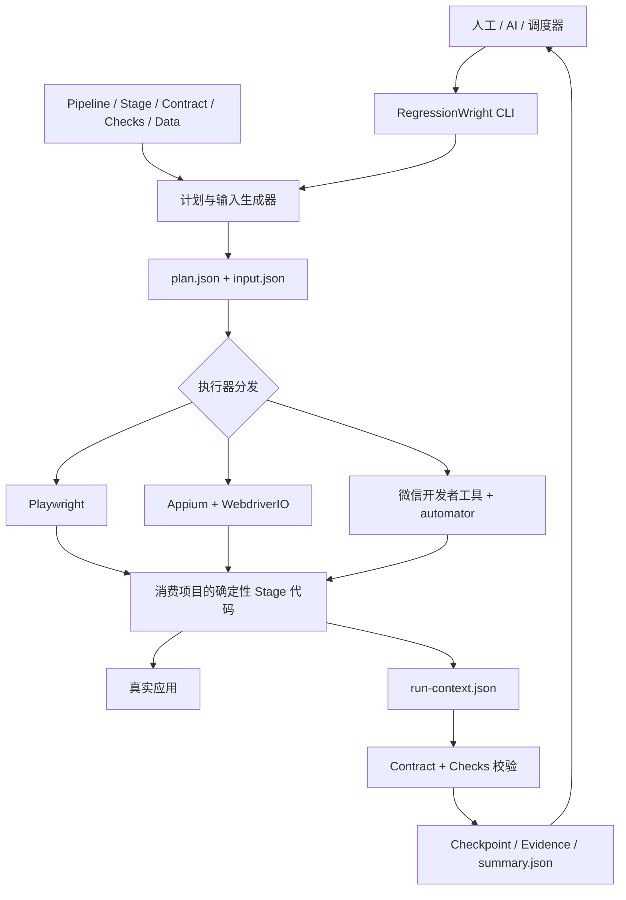
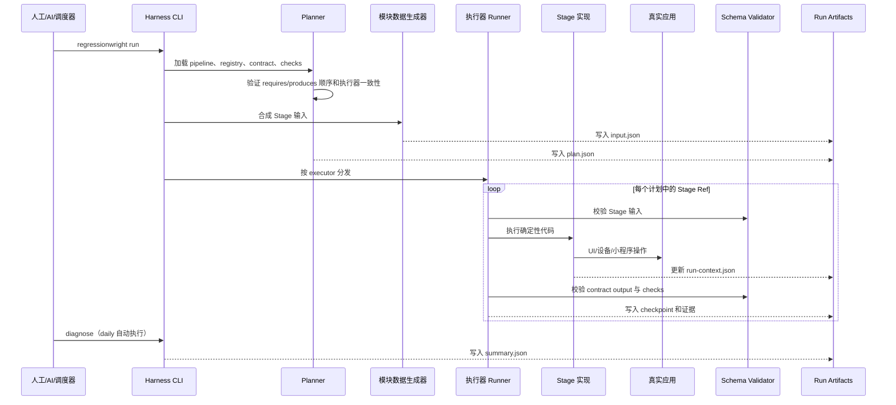

# RegressionWright 中文文档

[English](README.md) | 简体中文

RegressionWright 是一个确定性的、基于阶段（Stage）的端到端回归测试编排框架。它把业务回归流程拆成可复用的 Stage，由代码稳定执行 Web、原生移动端或微信小程序操作；AI 和人工负责规划、观察、诊断以及在初始化阶段维护测试代码，而不是在日常回归中临时接管浏览器完成操作。

这个仓库提供的是通用 Harness（测试编排内核），不是某个具体业务的测试项目。真实项目应通过脚手架生成独立的消费项目，并在消费项目中保存自己的流程、选择器、账号、环境配置和运行产物。

> 当前包名：`@vurtnec_/regressionwright`，版本：`0.1.2`。项目采用 MIT License。

## 目录

- [项目解决什么问题](#项目解决什么问题)
- [支持的执行器](#支持的执行器)
- [整体架构](#整体架构)
- [核心概念](#核心概念)
- [仓库与消费项目的边界](#仓库与消费项目的边界)
- [环境要求](#环境要求)
- [快速开始](#快速开始)
- [生成项目的目录结构](#生成项目的目录结构)
- [一次运行是如何完成的](#一次运行是如何完成的)
- [配置与数据模型](#配置与数据模型)
- [命令行参考](#命令行参考)
- [运行产物与失败诊断](#运行产物与失败诊断)
- [恢复执行](#恢复执行)
- [如何新增一个 Stage](#如何新增一个-stage)
- [三类执行器的配置](#三类执行器的配置)
- [AI 协作边界](#ai-协作边界)
- [包开发与验证](#包开发与验证)
- [常见问题](#常见问题)

## 项目解决什么问题

传统 E2E 测试通常会遇到以下问题：

- 测试代码、测试数据、断言和流程编排耦合在同一个脚本中，难以复用和定位问题；
- 多个步骤之间依赖隐式的页面状态，失败后无法可靠恢复；
- AI 自动化容易退化成“AI 临时点击页面”，结果不可重复，也难以放进 CI 或定时任务；
- 截图、trace、输入、输出和错误分散在不同目录，无法还原一次运行；
- 同一套业务回归需要覆盖 Web、移动端和小程序时，各自形成完全不同的管理方式。

RegressionWright 的处理方式是：

1. 用 Pipeline 描述业务流程，只负责选择和排列 Stage；
2. 用 Stage 元数据关联实现、契约、输入模板和 checks；
3. 用确定性的执行器代码完成真实 UI 操作；
4. 用 `input.json` 固化本次输入，用 `run-context.json` 作为 Stage 间唯一的状态传递通道；
5. 在每个 Stage 前后执行 schema 校验，并记录 checkpoint；
6. 将计划、数据、状态、报告和证据统一保存在本次 run 的目录中；
7. 让 AI 从这些结构化文件中观察和诊断，而不是在日常运行时直接操作应用。

## 支持的执行器

| 执行器 | 目标 | 运行方式 | 当前边界 |
|---|---|---|---|
| `playwright` | Web 应用 | 内置 Playwright test runner | 消费项目拥有页面对象和 Stage 代码 |
| `appium` | 原生移动应用 | 内置 Appium pipeline loop，消费项目创建 WebdriverIO session | 脚手架默认面向 iOS + XCUITest |
| `miniprogram` | 微信小程序 | 内置项目 runner，消费项目创建 `miniprogram-automator` session | 依赖已登录并开启服务端口的微信开发者工具 |

需要注意：

- 当前不支持在同一个 Pipeline 中混用多种执行器；规划阶段会直接拒绝 mixed-executor pipeline。
- Appium 脚手架通过 Appium 驱动 XCUITest，不支持绕过 Appium 直接运行 XCUITest。
- Harness 不会静默安装浏览器、Appium driver、启动设备、修改 iOS 签名设置或登录微信开发者工具，这些都是显式前置条件。

## 整体架构



这套架构中最重要的边界不是“浏览器和代码之间的边界”，而是“元数据与运行产物之间的边界”。只要一次运行能完整生成计划、输入、上下文、checkpoint 和证据，人工、AI 或调度器就可以用同一种方式理解结果。

### 设计原则

- **确定性执行**：日常回归只执行版本化的 Stage 代码，不依赖 AI 临场完成业务操作。
- **编排与实现分离**：Pipeline 只组合 Stage，不包含选择器和断言实现。
- **显式契约**：Stage 的输入、输出和错误都有 schema；流程依赖由 `requires` / `produces` 声明。
- **单一状态通道**：Stage 间只通过 `run-context.json` 传递状态，不依赖进程内的隐式全局变量。
- **一次运行一个证据目录**：下一次运行不会覆盖上一次的计划、trace、截图或报告。
- **项目无关的内核**：业务 URL、账号、页面对象、选择器和数据必须留在消费项目中。

## 核心概念

### Pipeline

Pipeline 是用户要执行的完整业务流程，由有序的 Stage Ref 组成。例如：健康检查 → 内容校验 → 汇总校验。

Pipeline 负责回答“按什么顺序运行哪些 Stage”，不负责回答“如何点击页面”或“如何计算业务结果”。

### Stage

Stage 是可复用的业务能力，例如 `health-check`、`content-check` 或 `launch-app`。一个 Stage 可以有多个 Variant。

### Variant

Variant 是 Stage 的一种具体实现方式。例如同一个 `content-check` 可以有：

- `default`：只验证首页标题和正文；
- `strict`：继续点击链接并验证目标页面。

Variant 应通过元数据显式选择，不建议在一个实现中塞入大量隐藏的环境分支。

### Stage Ref 与 refId

Stage Ref 是 Pipeline 中的一个位置，通常包含：

```json
{
  "stage": "content-check",
  "variant": "strict",
  "input": "strict",
  "checks": "full-regression",
  "resumeBoundary": false
}
```

每个位置会得到一个运行时 `refId`，如 `content-check/strict`。同一个 Stage + Variant 出现多次时，后续实例会成为 `content-check/strict#2`。如果指定了 actor，ref 还可能带有 `@actor` 后缀。`refId` 用于精确关联本次 Stage 输入、checkpoint 和恢复位置。

### Contract

Contract 是一个 Stage Variant 的稳定边界，包含：

- `requires`：执行前依赖的输入或上游输出；
- `produces`：成功后产生的上下文状态；
- `inputSchema`：本 Stage 输入的 JSON Schema；
- `outputSchema`：执行后整个 run context 必须满足的 JSON Schema；
- `errorSchema`：失败时结构化错误必须满足的 schema；
- `sideEffects` 和 `evidence`：副作用及应保留的证据说明。

Harness 在生成计划时验证 Stage 顺序，在运行前验证输入，在运行后验证输出，并在失败时验证结构化错误。

### Checks

Checks 是可选择的输出断言集合。Stage 代码负责观察页面并把事实写入 context，例如：

```json
{
  "state": {
    "contentChecks": {
      "default": {
        "checked": true,
        "matchedHeading": "Example Domain"
      }
    }
  }
}
```

Checks 再通过 schema 断言这些事实。这样同一个 Stage 可以提供 `smoke`、`regression`、`full-regression` 等不同强度，而不需要复制浏览器操作代码。

### Run Context 与 Checkpoint

`run-context.json` 保存：

- run、pipeline、environment 等身份信息；
- 固化后的 plan 和 input；
- Stage 写入的 `state`；
- 每个 Stage 的 passed/failed checkpoint；
- 失败错误、断言结果和 resume 来源。

每完成一个 Stage，Harness 都会原子写入 context：先写临时文件，再 rename 到正式文件，以减少进程意外中断造成空文件或半截 JSON 的风险。

## 仓库与消费项目的边界

### 本仓库负责

```text
bin/                         两个 CLI 入口
scripts/                     Harness、执行器分发、认证和 profile 工具
src/core/                    计划、输入、schema、context、错误、证据等通用能力
src/integrations/            可复用的第三方集成，目前包含 Gmail
tests/core/                  内核单元测试
tests/integrations/          集成模块测试
tests/harness/               Playwright 通用 runner
templates/project/           Web/Playwright 项目模板
templates/appium-project/    iOS Appium 项目模板
templates/miniprogram-project/ 微信小程序项目模板
skills/regressionwright/     AI 操作手册
docs/                        架构、流程和打包边界说明
```

### 消费项目负责

```text
config/                      Harness 注册和环境配置
pipelines/{module}/          Pipeline 定义
stage-registry/              Stage 注册表
stages/{module}/             Stage 元数据
contracts/{module}/          输入、输出、错误契约
checks/{module}/             可选断言集合
data-templates/{module}/     Stage 默认数据和数据规则
src/modules/{module}/        项目 adapter 与数据生成器
tests/{module}/              确定性 Stage 实现和 pipeline runner
artifacts/                   本地运行产物
```

以下内容不应提交到本仓库：业务流程、真实环境 URL、账号或 token、客户数据、页面选择器、浏览器 profile、认证状态、截图、trace 和生成的 run artifacts。

## 环境要求

通用要求：

- Node.js `>= 20.0.0`；
- pnpm `>= 9.0.0`，本仓库声明的包管理器版本是 `pnpm@10.33.0`；
- Git。

Web 项目还需要安装 Playwright Chromium：

```bash
pnpm exec playwright install chromium
```

Appium iOS 项目还需要 macOS、兼容的 Xcode、iOS 模拟器或真机、可运行的 `.app` 或已安装的 bundle id。生成项目对 Node.js 的约束为 `^20.19.0 || ^22.12.0 || >=24.0.0`。

微信小程序项目还需要已安装并登录的微信开发者工具，并在“设置 → 安全”中开启服务端口。生成项目同样要求 Node.js `^20.19.0 || ^22.12.0 || >=24.0.0`。

## 快速开始

### 方式一：从 Harness 源码创建项目

这是本地开发最直接的方式。生成的业务测试项目应位于当前 pnpm workspace 之外。

```bash
git clone https://github.com/vurtnec/regressionwright.git
cd regressionwright
pnpm install
```

创建 Web 项目：

```bash
pnpm run create ../my-project-regression-test \
  --module my-project \
  --core-package "file:$PWD" \
  --integration codex
```

然后进入生成的项目：

```bash
cd ../my-project-regression-test
pnpm install
pnpm exec playwright install chromium
pnpm regressionwright registry
pnpm regressionwright run --env dev --site default --headed
```

脚手架自带的 Web 示例会访问 `https://example.com`，因此不接入真实业务也可以先验证基础链路。

### 创建 Appium iOS 项目

```bash
pnpm run create ../my-ios-regression-test \
  --module my-ios-app \
  --executor appium \
  --core-package "file:$PWD" \
  --integration codex
```

生成后：

```bash
cd ../my-ios-regression-test
pnpm install
pnpm appium:driver:install
pnpm appium:driver:list
```

编辑 `config/dev.json` 中的设备、系统版本和 app 路径，然后在终端一启动：

```bash
pnpm appium:server
```

在终端二运行：

```bash
pnpm regressionwright registry
pnpm regressionwright run --env dev
```

### 创建微信小程序项目

```bash
pnpm run create ../my-miniprogram-regression-test \
  --module my-miniprogram \
  --executor miniprogram \
  --core-package "file:$PWD" \
  --integration codex
```

生成后：

```bash
cd ../my-miniprogram-regression-test
pnpm install
pnpm regressionwright registry
pnpm regressionwright run --env dev
```

模板内置一个两页小程序 fixture。默认流程会启动首页、点击 `#settings-link`，然后验证 Settings 路由和标题。

### 方式二：从本地 tarball 模拟发布

在 Harness 根目录打包：

```bash
pnpm pack
```

根据实际生成的版本号设置 tarball 路径，再创建项目：

```bash
pkg="$PWD/vurtnec_-regressionwright-0.1.2.tgz"
pnpm dlx --package "$pkg" create-regressionwright ../demo-regression-test \
  --module demo \
  --core-package "file:$pkg" \
  --integration codex
```

### 方式三：从 npm 创建项目

```bash
pnpm dlx --package @vurtnec_/regressionwright \
  create-regressionwright my-project-regression-test \
  --module my-project \
  --integration codex
cd my-project-regression-test
pnpm install
pnpm exec playwright install chromium
pnpm regressionwright registry
pnpm regressionwright run --headed
```

### create-regressionwright 参数

| 参数 | 作用 | 默认值 |
|---|---|---|
| `<project-dir>` | 目标项目目录，必填 | 无 |
| `--module <id>` | 初始模块 id | 根据目录名推导 |
| `--package-name <name>` | 生成项目的 package name | 目录名 |
| `--core-package <specifier>` | 内核依赖版本、`file:` 路径或 tarball | `^0.1.0` |
| `--executor <name>` | `playwright`、`appium` 或 `miniprogram` | `playwright` |
| `--integration <name>` | 安装 `codex`、`claude` 或 `all` 项目级 skill | 不安装 |
| `--reporter stagewright` | 为 Web 项目添加可选 StageWright reporter | 不安装 |
| `--force` | 允许写入非空目标目录 | `false` |

`--reporter stagewright` 仅支持 Playwright。它只会向生成项目添加 `playwright-smart-reporter@1.6.5`，不会成为内核依赖，也不会参与 Stage 的通过/失败判定。

## 生成项目的目录结构

以 Web 模板为例：

```text
my-project-regression-test/
├── config/
│   ├── harness.json
│   └── dev.json
├── pipelines/my-project/regression.json
├── stage-registry/my-project.json
├── stages/my-project/{stage}/{variant}.json
├── contracts/my-project/*.json
├── checks/my-project/{stage}/*.json
├── data-templates/my-project/stage-data/{stage}/*.json
├── src/modules/my-project/
│   ├── harness-adapter.mjs
│   ├── run-context.ts
│   └── run-data.mjs
├── tests/
│   ├── harness/pipeline-runner.spec.mjs
│   └── my-project/
│       ├── pipeline-runner.mjs
│       └── stages/*.mjs
├── playwright.config.ts
├── package.json
└── tsconfig.json
```

`tests/harness/pipeline-runner.spec.mjs` 是消费项目中的本地 shim，它导入包内的通用 Playwright runner。保留这个本地入口很重要，因为 Playwright 可能忽略直接位于 `node_modules` 中的 spec。

## 一次运行是如何完成的



### 1. 定位消费项目根目录

内核从当前目录向上查找 `config/harness.json`。也可以显式指定：

```bash
export E2E_REGRESSION_PROJECT_ROOT=/absolute/path/to/regression-project
```

包自身路径和消费项目路径是分开的：前者用于加载通用 runner，后者用于加载业务配置、模块代码和产物。

### 2. 加载模块 Adapter

`config/harness.json` 注册模块和 adapter：

```json
{
  "schemaVersion": 1,
  "defaultModule": "my-project",
  "modules": {
    "my-project": {
      "description": "My project regression module.",
      "adapterPath": "src/modules/my-project/harness-adapter.mjs"
    }
  }
}
```

Web 模板中的 adapter 至少提供：

```js
export const defaultPipelineId = 'my-project-regression';
export const pipelineRunnerModule = 'tests/my-project/pipeline-runner.mjs';
export const playwrightSpecPath = 'tests/harness/pipeline-runner.spec.mjs';
```

Adapter 还可以实现项目参数校验、运行时输入、环境变量注入、认证/profile 支持、AI 参数上下文、运行后报告钩子和诊断摘要扩展。

### 3. 创建 Plan

Planner 将 Pipeline 中的 Stage Ref 解析为完整 Stage Definition、Contract、Checks 和 executor 信息，生成 `plan.json`。

生成计划时会检查：

- Stage id 或 `stage + variant` 是否能唯一解析；
- Stage registry 与 contract 的 id、module 是否一致；
- checks 的 module、stage、id 是否一致；
- 非 `input.*` 的 `requires` 是否已经由前序 Stage 的 `produces` 提供；
- 所选 Stage 是否属于同一种 executor；
- 同一个 Playwright plan 是否可以由唯一 spec 执行。

### 4. 创建 Input

每次运行先执行消费项目的 `src/modules/{module}/run-data.mjs` 中的：

```js
export function createRegressionInput(params) {}
```

Stage 数据的确定性合并顺序是：

```text
基础 stage data
  + profiles[env.dataProfile]
  + --input-params / --data-params
```

最终数据被写入本次 run 的 `input.json`。`profiles` 只是创作辅助字段，不会保留在最终 Stage 输入中。

执行开始以后，Stage 只读取已经固化的 `input.json`；不会在中途再次请求 AI 生成数据。

### 5. 分发执行器

- Playwright：调用消费项目或包内可用的 Playwright binary，执行 Chromium project；
- Appium：启动包内 `scripts/appium-runner.mjs`，再加载消费项目的 pipeline runner；
- Mini Program：启动包内 `scripts/miniprogram-runner.mjs`，再加载消费项目的 pipeline runner。

对于 Appium 和小程序，消费项目的 runner 必须返回：

```js
{
  run,
  async runStage(stage) {},
  async close() {}
}
```

### 6. 校验并记录

通用 `runStage()` 包装器依次完成：

1. `assertStageInput()`；
2. 执行业务 Stage；
3. `assertStageOutput()`，其中同时校验 contract 和所选 checks；
4. 写入 passed checkpoint；
5. 失败时分类错误、收集 evidence、校验 error schema，并写入 failed checkpoint。

## 配置与数据模型

### 环境配置

环境文件位于 `config/{env}.json`。Web 模板示例：

```json
{
  "name": "dev",
  "dataProfile": "dev",
  "my-project": {
    "defaultSite": "default",
    "sites": {
      "default": {
        "baseUrl": "https://example.com",
        "expectedTitleContains": "Example"
      }
    }
  }
}
```

通过 `--env dev` 选择环境，通过项目 adapter 支持的 `--site default` 选择站点。`--site` 不是内核硬编码参数，而是作为 project option 交给 adapter 处理。

### Stage Registry

`stage-registry/{module}.json` 列出 Stage Definition 文件：

```json
{
  "schemaVersion": 1,
  "module": "my-project",
  "stageDefinitions": [
    "stages/my-project/health-check/default.json",
    "stages/my-project/content-check/default.json"
  ]
}
```

### Stage Definition

Definition 把 Stage 的各个组成部分连接起来：

```json
{
  "id": "content-check-default",
  "stage": "content-check",
  "variant": "default",
  "dataKey": "contentCheck",
  "contractPath": "contracts/my-project/content-check-default.json",
  "implementationPath": "tests/my-project/stages/content-check.mjs",
  "defaultInput": "default",
  "defaultChecks": "regression",
  "executor": {
    "type": "playwright",
    "specPath": "tests/my-project/pipeline-runner.mjs"
  },
  "tags": ["content-check"],
  "status": "active"
}
```

`implementationPath` 是元数据和工具可读的实现位置；实际执行器映射由消费项目的 `pipeline-runner.mjs` 注册。

### Pipeline

```json
{
  "id": "my-project-regression",
  "name": "My Project Regression",
  "module": "my-project",
  "stages": [
    {
      "stage": "health-check",
      "variant": "default",
      "input": "default",
      "checks": "regression",
      "resumeBoundary": true,
      "pipelineDefault": true
    },
    {
      "stage": "content-check",
      "variant": "default",
      "input": "default",
      "checks": "regression",
      "pipelineDefault": true
    }
  ]
}
```

- `pipelineDefault: false` 表示正常执行整个 Pipeline 时跳过，但仍可通过 `--stages` 显式选择；
- `resumeBoundary: true` 表示这里是适合恢复执行的安全起点；
- `actor` 可用于同一流程中区分不同操作主体；
- `input` 选择 Stage 默认数据文件；
- `checks` 选择本次使用的断言强度。

### 常用环境变量

CLI 会为 runner 设置一组 `E2E_REGRESSION_*` 变量：

| 变量 | 含义 |
|---|---|
| `E2E_REGRESSION_PROJECT_ROOT` | 显式指定消费项目根目录 |
| `E2E_REGRESSION_MODULE` | 当前模块 |
| `E2E_REGRESSION_ENV` | 当前环境 |
| `E2E_REGRESSION_PIPELINE` | Pipeline id |
| `E2E_REGRESSION_RUN_ID` | Run id |
| `E2E_REGRESSION_RUN_DIR` | 本次产物目录 |
| `E2E_REGRESSION_PLAN_PATH` | `plan.json` 路径 |
| `E2E_REGRESSION_INPUT_PATH` | `input.json` 路径 |
| `E2E_REGRESSION_STAGE_FILTER` | 本次选择的 Stage refs |
| `E2E_REGRESSION_HEADLESS` | `1` 为无头，`0` 为 headed |
| `E2E_REGRESSION_EXECUTOR` | 当前 executor type |
| `E2E_REGRESSION_EXECUTOR_OUTPUT_DIR` | 当前 executor 的证据目录 |
| `E2E_REGRESSION_DATA_VARIANT` | 数据变体 |
| `E2E_REGRESSION_INPUT_PARAMS` | JSON 或 JSON 文件形式的输入覆盖 |

Playwright 还会收到 `E2E_REGRESSION_PLAYWRIGHT_OUTPUT_DIR` 和 `E2E_REGRESSION_PLAYWRIGHT_REPORT_DIR`；Appium 和小程序分别收到对应的 `APPIUM_OUTPUT_DIR`、`MINIPROGRAM_OUTPUT_DIR`。

## 命令行参考

### 命令总览

| 命令 | 用途 |
|---|---|
| `run` | 执行一次 Pipeline 或选定的 Stage |
| `run-many` | 串行执行多个 Pipeline |
| `daily` | 执行 Pipeline，并在完成后自动运行 diagnose |
| `resume` | 从历史 run 创建一次新的恢复运行 |
| `registry` | 输出模块中的 Pipeline 和 Stage 能力清单 |
| `diagnose` | 根据产物分类结果并生成 `summary.json` |
| `ai-params-context` | 输出供 AI 生成运行参数的结构化上下文 |
| `integration` | 在消费项目中安装 AI skill |
| `auth` | 由项目 adapter 驱动交互式认证并保存 storage state |
| `profile` | 打开由项目 adapter 配置的持久浏览器 profile |

### run

```bash
pnpm regressionwright run [pipeline-id] \
  [--module <module-id>] \
  [--env <env-name>] \
  [--stages <ref-or-id,...>] \
  [--input <input.json>] \
  [--input-params <json-or-file>] \
  [--data-variant <name>] \
  [--run-id <id>] \
  [--headed|--headless]
```

示例：

```bash
# 执行 adapter 的默认 Pipeline
pnpm regressionwright run --env dev

# 显式执行一个 Pipeline
pnpm regressionwright run my-project-regression --headed

# 只选择 Pipeline 中的部分 Stage
pnpm regressionwright run my-project-regression \
  --stages health-check/default,content-check/default

# 使用内联 JSON 覆盖输入
pnpm regressionwright run my-project-regression \
  --input-params '{"contentCheck":{"expectedHeading":"Example Domain"}}'

# 从文件读取覆盖参数
pnpm regressionwright run my-project-regression \
  --input-params ./local/input-params.json
```

除了内核参数，未知的 `--foo value` 会转换为 camelCase project option，交给 adapter。例如模板中的 `--site default` 会成为 `projectOptions.site`。项目 adapter 应负责验证这些参数。

### run-many

```bash
pnpm regressionwright run-many pipeline-a pipeline-b --env dev

pnpm regressionwright run-many \
  --pipelines pipeline-a,pipeline-b \
  --delay 10 \
  --continue-on-failure
```

- 默认遇到第一个失败就停止；
- `--continue-on-failure` 会继续后续 Pipeline；
- `--delay <seconds>` 或 `--delay-ms <milliseconds>` 可在 Pipeline 间等待；
- 其他 run 参数会转发给每次 `run`。

### daily

```bash
pnpm regressionwright daily my-project-regression --env dev
```

`daily` 的执行逻辑与 `run` 相同，但结束后无论通过或失败都会输出诊断摘要并写入 `summary.json`。这是定时回归和日常 AI 观察的推荐入口。

### registry

```bash
pnpm regressionwright registry
pnpm regressionwright registry my-project
pnpm regressionwright registry --module my-project
```

输出包括模块描述、可用 Pipeline、Stage、Variant、executor、默认输入、可选 checks、requires、produces 和实现路径。新增元数据后，建议先运行此命令验证注册关系。

### diagnose

```bash
pnpm regressionwright diagnose artifacts/runs/{pipeline}/{runId}
pnpm regressionwright diagnose artifacts/runs/{pipeline}/{runId}/run-context.json
```

该命令读取 plan、input 和 context，对运行状态进行分类，打印并写入 `summary.json`。

### ai-params-context

```bash
pnpm regressionwright ai-params-context my-project-regression --env dev
```

它会生成 plan 和基础 input 的只读上下文，列出可覆盖的 Stage 输入，并给出最终 daily 命令模板。AI 可据此先生成 `input-params.json`，再启动普通的确定性运行。

### integration

```bash
pnpm regressionwright --integration codex
pnpm regressionwright integration install claude
pnpm regressionwright integration install all
pnpm regressionwright integration list
```

Skill 只安装在当前消费项目中：

```text
.agents/skills/regressionwright/
.claude/skills/regressionwright/
```

命令不会修改用户级 AI 配置。

### auth 与 profile

```bash
pnpm regressionwright auth --module my-project --env dev
pnpm regressionwright profile --module my-project --env dev
```

这两个命令只适用于在 `harness-adapter.mjs` 中实现了相应 hook 的 Web 模块：

- `auth` 需要 `createAuthSessionConfig()` 和 `waitForAuthReady()`，登录完成后保存 Playwright storage state；
- `profile` 需要 `createBrowserProfileConfig()`，它打开持久 profile 并等待用户按 Enter 后关闭。

## 运行产物与失败诊断

每次运行使用类似 `REG-20260725-...` 的独立 run id，产物位于：

```text
artifacts/runs/{pipeline}/{runId}/
├── plan.json
├── input.json
├── run-context.json
├── summary.json                 # daily 或 diagnose 后生成
├── performance.json            # 使用性能监控器时生成
├── performance-summary.md      # 使用性能监控器时生成
├── playwright/                 # Playwright 原始输出
├── playwright-report/          # Playwright HTML 报告
├── appium/                     # Appium 证据，仅 Appium run
└── miniprogram/                # 小程序证据，仅 Mini Program run
```

建议按以下顺序排查失败：

1. `summary.json`：先看总体状态、分类、失败 Stage 和 error code；
2. `plan.json`：确认实际执行的 Stage、variant、checks 和顺序；
3. `input.json`：确认本次运行真正使用的数据，而不是只看配置默认值；
4. `run-context.json`：检查已通过 checkpoint、失败错误以及 Stage 写入的 state；
5. executor 目录：最后查看 screenshot、trace、日志或设备证据。

### 失败分类

| 分类 | 常见 error code | 含义 |
|---|---|---|
| `env_issue` | `AUTH_REQUIRED`、`ENVIRONMENT_ERROR` | 认证、浏览器安装、网络、Appium server、driver、微信开发者工具等环境问题 |
| `planning_error` | `PRECONDITION_FAILED` | Stage 顺序或前置输出不满足 |
| `script_issue` | `SELECTOR_NOT_FOUND`、`VALIDATION_ERROR`、`TIMEOUT` | 选择器、等待策略、测试数据或 schema 不匹配 |
| `app_bug` | `APP_ERROR` | 有效输入通过真实 UI 暴露了产品行为错误 |
| `unknown` | `UNKNOWN` | 当前规则无法可靠分类，需要结合证据判断 |

诊断是基于结构化错误和已知消息模式的启发式分类，不应把 `unknown` 自动等价为产品缺陷。

### 性能监控

Web Stage 可以使用公开 API：

```js
import { createPerformanceMonitor } from '@vurtnec_/regressionwright/performance-monitor.mjs';
```

Stage 应在真正代表业务 ready 的位置显式标记 `initial-render` 或 `action` 测量窗口。报告可包含：耗时、前后 URL/标题、后端 API 数量、失败 API、console/page error、long task、navigation timing，以及按 method + path 聚合的 API P90/P95。

性能监控器不会自动猜测“页面何时业务可用”，这个判断仍属于消费项目。

### 可选 StageWright 报告

使用 `--reporter stagewright` 创建的 Web 项目会额外生成：

```text
artifacts/runs/{pipeline}/{runId}/playwright-report/stagewright-report.html
artifacts/stagewright-history/
```

生成配置默认关闭 StageWright 云上传和托管 AI 功能。最终通过/失败仍以 Harness checks、contract 和 `summary.json` 为准。

## 恢复执行

```bash
pnpm regressionwright resume artifacts/runs/{pipeline}/{runId}
pnpm regressionwright resume artifacts/runs/{pipeline}/{runId} --headed
pnpm regressionwright resume artifacts/runs/{pipeline}/{runId} --from content-check/default
```

恢复流程：

1. 读取源 run 的 `plan.json`、`input.json` 和 `run-context.json`；
2. 找到失败 Stage，或第一个尚未完成的 Stage；
3. 向前回溯到最近的 `resumeBoundary: true`；
4. 创建新的 run id 和新目录；
5. 复制旧 input 和恢复起点之前的 context/checkpoints；
6. 从恢复边界继续执行剩余 Stage。

源 run 不会被修改。新 `input.json` 和 context 会记录 `sourceRunId`、`sourceRunDir` 和 `startStageId`。

Harness 不理解具体业务如何回滚。对支付、提交、创建资源等非幂等 Stage，执行器必须自行根据 context 选择：复用已有结果、检查资源是否已存在、走安全恢复路径，或用结构化错误停止。

## 如何新增一个 Stage

以下流程以 Web 项目为例，Appium 和小程序的数据模型相同，只是 Stage 实现使用的客户端不同。

### 1. 明确业务边界

先决定这个 Stage 的职责、输入、前置状态、输出事实和副作用。一个 Stage 应对应可解释的业务能力，不要简单按每一次点击拆分，也不要把整条复杂业务链塞进一个 Stage。

### 2. 创建 Stage Definition

在 `stages/{module}/{stage}/{variant}.json` 中声明 id、variant、contract、实现、数据和 executor，并将路径加入 `stage-registry/{module}.json`。

### 3. 创建 Contract

在 `contracts/{module}/` 中定义：

- 输入需要哪些字段；
- 执行前需要哪些上游 `produces`；
- 成功后写入 context 的哪些路径；
- 失败错误的结构；
- 该操作的副作用和证据类型。

`requires` 中以 `input.` 开头的项由 Stage 输入满足，其他项必须由更早的 Stage 产生，否则 Planner 会在启动执行器之前失败。

### 4. 准备默认数据

在 `data-templates/{module}/stage-data/{stage}/{input}.json` 中提供可复用默认值。如需按环境覆盖：

```json
{
  "expectedHeading": "Default Heading",
  "profiles": {
    "dev": {
      "expectedHeading": "Development Heading"
    }
  }
}
```

### 5. 编写确定性执行器

实现文件从 `inputForStage(run, stage)` 获取该 Stage Ref 的最终输入，执行真实 UI 操作，并把观察到的事实写入 `run.state`。不要在实现中重新读取未固化的数据源，也不要依赖上一个 Stage 留下的模块级变量。

### 6. 添加 Checks

在 `checks/{module}/{stage}/{checks}.json` 中对 context 中的业务事实编写 schema。Contract 保护实现的稳定输出边界，Checks 表达本次回归希望验证的强度。

### 7. 注册执行器

在项目的 `tests/{module}/pipeline-runner.mjs` 中将 Stage Definition id 映射到实现函数，例如：

```js
const executors = {
  'health-check-default': healthCheckStage,
  'content-check-default': contentCheckStage,
};
```

### 8. 加入 Pipeline 并验证

```bash
pnpm regressionwright registry
pnpm regressionwright run {pipeline-id} --stages {stage-ref} --headed
pnpm regressionwright daily {pipeline-id}
```

如果 Stage 依赖前序输出，`--stages` 需要同时包含能够满足 `requires` 的前序 Stage，或者从专门的 context-loading Stage 开始。

## 三类执行器的配置

### Playwright

Web 项目由 adapter 提供 `playwrightSpecPath`，通用 spec 再加载项目 `pipelineRunnerModule`。每次运行固定使用 Chromium project；`--headed` 适合 Stage 编写与调试，日常运行默认 headless。

Playwright 报告与原始证据都会指向本次 run 的目录，因此并发策略或外层调度器仍需避免手工复用相同 `--run-id`。

### Appium iOS

`config/dev.json` 的核心结构：

```json
{
  "name": "dev",
  "my-ios-app": {
    "appium": {
      "protocol": "http",
      "hostname": "127.0.0.1",
      "port": 4723,
      "path": "/",
      "logLevel": "info",
      "capabilities": {
        "platformName": "iOS",
        "appium:automationName": "XCUITest",
        "appium:deviceName": "iPhone Simulator",
        "appium:platformVersion": "SET_ME",
        "appium:app": "/absolute/path/to/MyApp.app"
      }
    }
  }
}
```

如果 app 已安装，可用 `appium:bundleId` 替换 `appium:app`；特定模拟器或真机可增加 `appium:udid`。项目 runner 负责 session 创建、selector、gesture 和 screenshot，Harness 负责 plan、契约、context、诊断和 resume。

### 微信小程序

`config/dev.json` 的核心结构：

```json
{
  "name": "dev",
  "my-miniprogram": {
    "miniprogram": {
      "cliPath": "/Applications/wechatwebdevtools.app/Contents/MacOS/cli",
      "projectPath": "fixtures/miniapp",
      "launchTimeoutMs": 60000,
      "trustProject": true
    }
  }
}
```

可以用环境变量覆盖路径，避免把本机绝对路径提交到仓库：

```bash
export WECHAT_DEVTOOLS_CLI=/Applications/wechatwebdevtools.app/Contents/MacOS/cli
export MINIPROGRAM_PROJECT_PATH=/absolute/path/to/miniprogram
```

项目 Stage 负责页面路由、选择器和交互，`miniprogram-automator` 与微信开发者工具负责自动化连接。

## AI 协作边界

RegressionWright 区分三种工作模式。

### 初始化或修复模式

目标是创建或修复稳定的回归能力。AI 可以阅读应用代码、查看页面、trace、截图和 Stage 内部实现，修改元数据、contract、checks、data 和执行器，并反复运行最小有效流程。

最终产物必须是可重复运行的确定性代码，而不是一份“AI 点击步骤”。

### 日常运行模式

目标是执行已经稳定的回归。AI 可以读取：

- Pipeline 与 Stage 元数据；
- `plan.json`、`input.json`、`run-context.json`、`summary.json`；
- screenshot、trace、设备日志和性能报告。

AI 不应进入运行中的浏览器或设备，手工完成失败 Stage。需要修复脚本时，应结束本次日常运行，进入初始化/修复模式，修改确定性代码后重新运行。

### AI 生成输入模式

AI 可以在运行开始前根据 `ai-params-context` 生成 `--input-params`。参数完成合并并写入 `input.json` 后，后续仍遵守日常运行的黑盒边界。

## 包开发与验证

在本仓库根目录：

```bash
pnpm install
pnpm verify
```

`verify` 依次执行：

```text
pnpm check       TypeScript --noEmit 检查
pnpm test:unit   tests/core 与 tests/integrations
pnpm pack:check  包内容和 exports 审计
```

构建发布文件：

```bash
pnpm build
pnpm pack
```

当修改脚手架时，除了 `pnpm verify`，还应生成一个项目，安装依赖并至少运行：

```bash
pnpm regressionwright registry
pnpm regressionwright run --headed
```

### 公共 API

推荐通过 `regressionwright` 和 `create-regressionwright` 两个 CLI 使用项目。代码级消费必须导入 `package.json` 的 `exports` 中明确公开的路径，例如：

```js
import { inputForStage } from '@vurtnec_/regressionwright/stage-input.mjs';
import { createResumedRunContext } from '@vurtnec_/regressionwright/run-context.mjs';
import { createStageError } from '@vurtnec_/regressionwright/stage-error.mjs';
```

不要直接导入包中未公开的 `src/`、`scripts/` 或 `tests/` 内部路径。公开 exports 才是兼容性边界。

## 常见问题

### 找不到 Playwright binary

错误通常会提示运行：

```bash
pnpm install
pnpm exec playwright install chromium
```

请在消费项目根目录执行，而不是只在 Harness 源码目录安装浏览器。

### 找不到 Pipeline、Stage 或 Contract

先运行：

```bash
pnpm regressionwright registry --module {module-id}
```

检查 `config/harness.json` 的 module、`stage-registry/{module}.json` 的定义路径，以及 Stage Definition 中的 id、module 和 `contractPath` 是否一致。

### 提示 missing required prior outputs

所选 Stage 的 `requires` 没有被更早 Stage 的 `produces` 满足。修复方式是补上必要的前序 Stage、调整顺序，或者新增显式的 context-loading Stage。不要仅为了绕过 Planner 删除真实业务依赖。

### Schema validation failed

- 输入错误：对照 `input.json` 与 contract 的 `inputSchema`；
- 输出错误：对照 `run-context.json` 与 `outputSchema`；
- checks 错误：确认 Stage 已写入 checks 要求的事实，并确认 Pipeline 选择了预期 checks id。

### Appium 无法创建 session

依次确认 Appium server 正在运行、XCUITest driver 已安装、设备/模拟器可用、platformVersion 与 deviceName 正确，以及 app 路径或 bundle id 有效。Harness 不会自动修复 Xcode signing 或 WebDriverAgent 配置。

### 微信小程序无法连接

确认微信开发者工具已登录、服务端口已开启、CLI 路径正确、项目路径可访问。优先使用 `WECHAT_DEVTOOLS_CLI` 与 `MINIPROGRAM_PROJECT_PATH` 覆盖本地差异。

### resume 重复了有副作用的操作

`resumeBoundary` 只是流程级安全起点，不会自动让业务操作幂等。涉及创建、支付、发送或提交的 Stage 必须检查已有 context 和应用状态，明确实现重用、验证、跳过或终止策略。

### 可以把业务测试直接放进本仓库吗

不建议。本仓库是通用内核，业务测试应放在独立消费项目中。只有当某项能力已经被至少两个不同项目证明为通用能力时，才适合考虑提升到 `src/core`。

## 安全与更多文档

- 不要提交 `.env`、认证状态、浏览器 profile、邮箱凭据、截图、trace、客户数据或运行产物；
- 安全漏洞不要通过公开 issue 报告，请使用仓库的私有 security advisory 渠道；
- 贡献代码前运行 `pnpm verify`，并确认改动保持项目无关。

进一步阅读：

- [英文 README](README.md)
- [框架边界](docs/framework.md)
- [架构说明](docs/regressionwright-architecture.md)
- [运行流程](docs/regressionwright-flows.md)
- [打包边界](docs/regressionwright-packaging.md)
- [AI Skill](skills/regressionwright/SKILL.md)
- [贡献指南](CONTRIBUTING.md)
- [安全策略](SECURITY.md)

## License

[MIT](LICENSE)
